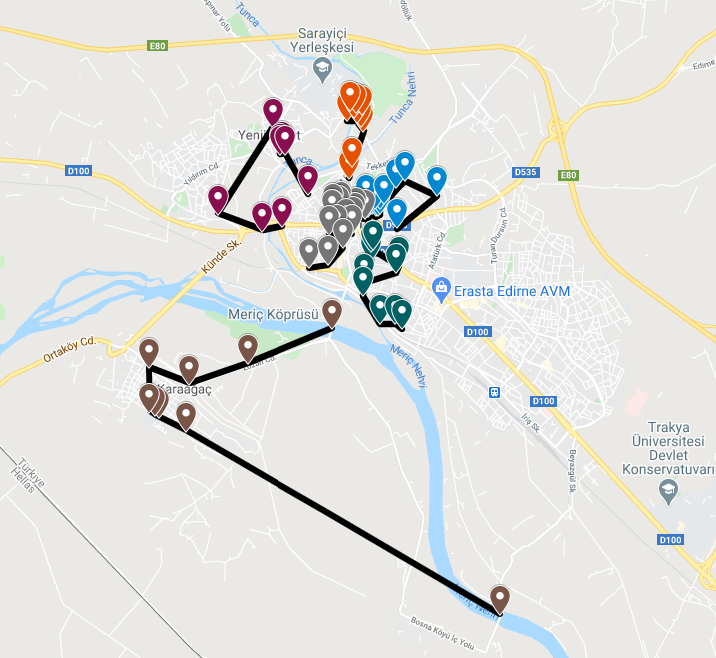

# 📍 Edirne Rehberi

### 🖐 Edirne'ye Hazırlık

Uzun zamandır gezmeyi planladığım ve gerek tarihi gerekse de günümüz haliyle hep merak ettiğim bir şehirdi. Öncelikle bu sebeple internetten araştırmalar yaptım. Daha önce buraya gitmiş yakın çevremden tavsiyeler ve gezi notları aldım. Sonrasında 3 gün 2 gecelik bir plana uygun olacak şekilde nasıl gezi yapabilirim diye çeşitli rota çalışmaları yaptım. 

Rota çalışmalarını yaparken dikkat ettiğim noktalar vardı. Bunlar;

* Kalacağım yerin, gezeceğim yerlere olan mesafesi ve sağladığı imkanlar
* Gezmeyi planladığım yerler arasındaki mesafelerin mümkün olduğunca eşit olması
* Yürüme mesafesi de göz önüne alınarak, dinlenebileceğim mekanların rota üzerinde olması
* Ulaşımın kolay olması ve trafiğin mümkün olduğunca az olması

Dört maddenin ilk üçünü anlarımda, sonuncusunun çok olduğunu düşünmüyorum. Demeyin ! Edirne merkezinde özellikle yaz aylarında hem göçmen vatandaşların hem de sınır komşularından gelen vatandaşlarının oluşturduğu yoğun bir trafik oluyor. Ayrıca park problemi de yaşıyorsunuz. Dolayısıyla gezeceğiniz yerleri mümkün olduğunda yürüyerek gezmeniz daha mantıklı. Aynı zamanda bir yeri gerçekten de gezmek istiyorsanız zaten yürümelisiniz.

### 🚏 Gelelim Rotaya

Tüm bunları göz önüne alınca Edirne gezimi altı bölgeye ayırdım. ilk iki bölge _\(Gri-Mavi\)_ eski şehir merkezinde yer alırken, üçüncü bölge _\(Yeşil\)_ biraz daha yeni şehir merkezine yakın. Onu dördüncü bölge _\(Kahverengi\)_ olarak Karaağaç takip ediyor. Daha sonrasında ise beşinci ve altıncı bölge _\(Mor-Turuncu\)_ Tunca Nehri'nin batı kısmında yani eski saray bölgesini içeriyor.

### **🚶‍♂️Bölgelerde Gezilecek Yerler**



* Selimiye Arastası
* Selimiye Camii
* Külliye Sağlık Müzesi
* Türk Ve İslam Eserleri Müzesi
* Osmanlı Mezar Taşları Sergileme Alanı
* Edirne Arkeoloji Ve Etnografya Müzesi
* Edirne Merkez Saray Hamamı
* Merzifonlu Kara Mustafa Paşa Çeşmesi
* Edirne Kent Müzesi
* Şahabettin Paşa Kirazlı Cami
* Ali Atik Paşa Cami
* Yeniçeri Hamamı \(Harabe\)
* Muradiye Cami
* Sv. Georgi Bulgar Kilisesi
* Yahya Bey Cami



* Yemiş Kapanı Hanı
* Tarihi Edirne Belediye Binası Ve Atatürk Odası
* Mimar Koca Sinan
* Saatli Medrese
* Üç Şerefeli \(Burmalı\) Camii
* Sokullu Mehmet Paşa Hamamı
* Eski Saat Kulesi
* Makedonya Kulesi
* Eski Camii
* Bedesten Çarşısı
* Tarihi Rüstempaşa Kervansarayı
* Alipaşa Çarşısı
* Maarif Su Terazisi
* Lari Cami
* Darü-l Hadis Camii
* Büyük Sinagog - Great Synagogue Of Edirne



* Edirne Lisesi Müzesi
* Sitti Şah Camii
* Eski Ulu Camii
* Ayşe Kadın Cami
* Ekmekçizade Kervansarayı
* Hasan Sezai Türbesi
* Süleymaniye Cami
* Kasımpaşa Camii
* Mezitbey Cami
* Constantin E Elena Bulgar Ortodoks Kilisesi



* Süvari \(NATO\) Köprüsü
* Timurtaş \(Demirtaş\) cami
* Milli Mücadele Ve Lozan Müzesi
* Karaağaç Tren İstasyonu
* Lozan Anıtı
* Karaağaç Eski Cami
* Karaağaç Köprüsü
* Balkan Şehitleri Anıtı
* Meriç Köprüsü



* Şah Melek Cami
* Gazi Mihalbey Cami
* Yıldırım Beyazıt Cami
* Alaca Mescit Cami
* Sinan Ağa Çeşmesi
* Çağdaş Resim Ve Heykel Müzesi
* II. Bayezid Külliyesi - Sağlık Müzesi
* Beyazıt II Cami
* Tarihi Harap Minare



* Beylerbeyi Cami
* Çakır Ağa Cami
* Pehlivan Heykeli \(Kurtdereli-kel Aliço-koca Yusuf\)
* Ahmet Taşçı-adalı Halil Abideleri
* Tarihi Kasr-ı Adalet \(Yargıtay Binası\)
* Matbah-ı Âmire
* Fatih Bridge
* Edirne Balkan Şehitliği
* Harabe Kum Kasrı Hamamı
* Edirne Sarayı



> 🚨 Gezilecek yerler ve bölgeler mutlaka kalmayı planladığın otele göre yeniden düzenlenmeli.

