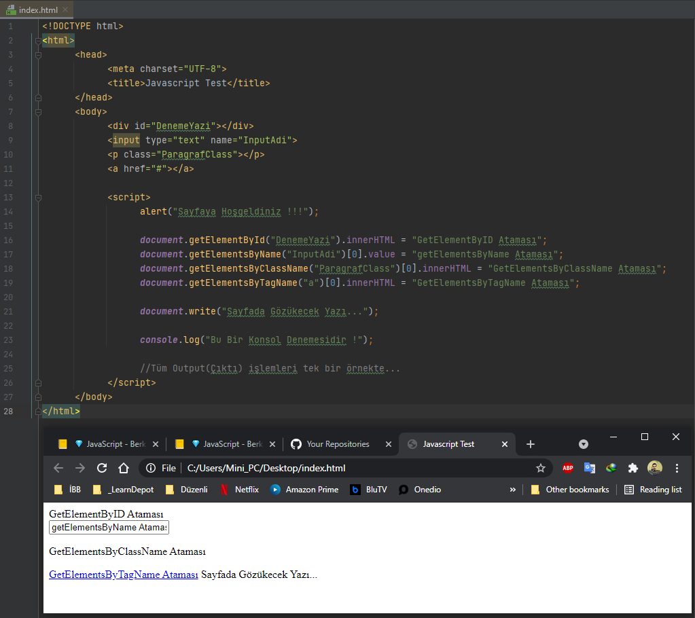
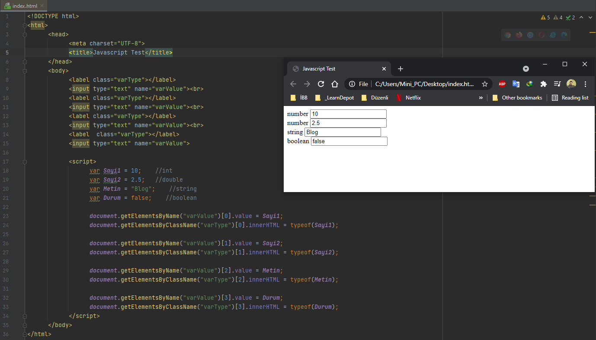
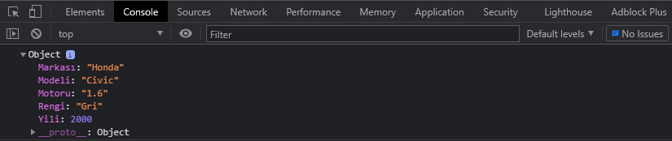
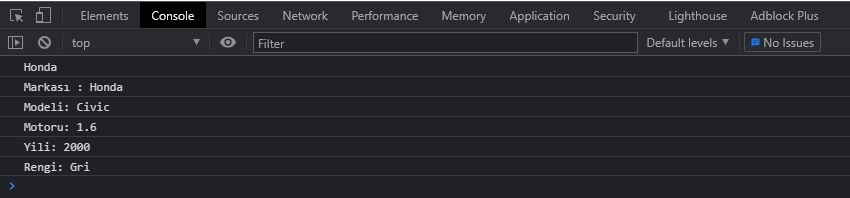
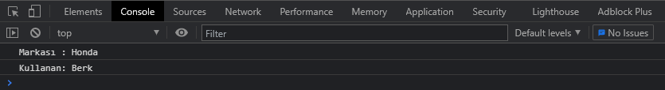
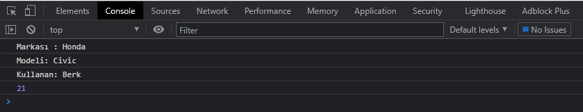
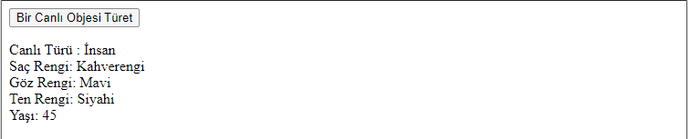

# 💎 JavaScript

## Javascirpt Tanımlama ve Dış Bağlantı

```markup
<!DOCTYPE html>
<html>
      <head> 
            <meta charset="UTF-8">
            <title>Javascript Test</title>
            <script> alert("Merhaba !"); </script>
      </head> 
      <body> 
            <script> alert("Merhaba !"); </script>
      </body>
</html>
```

🔵 Javascript genellikle _**&lt;head&gt;**_ veya _**&lt;body&gt;**_ tag'ları içerisinde çalıştırılır. Her ikisine de yazılmasına gerek yoktur. Sayfanın çalıştırılma prensibi ve yükleme hızı göz önüne alınarak tercihte bulunularak yazılır. Yukarıdaki örnekte basit bir Javascript yapısı bulunmaktadır. Javascript tanımlamaları sayfa içerisinde yapılacaksa mutlaka _**&lt;script&gt;**_ ile başlamalı ve _**&lt;/script&gt;**_ ile kapatılmalıdır. Script tagları içerisinde bulunun _**alert\(\);**_ ise sayfa yüklendiğinde ekrana uyarı mesajı verilmesini sağlar. \(Daha sonraki aşamalarda detaylı bir şekilde bulunmaktadır.\)


🔵 Eğer Javascript tagları içerisinde komplike ve birden fazla işlem yapılacaksa hem daha düzenli olması hem de ileride yapılabilecek değişikliklerde yada meydana gelecek hatalarda kod satırlarının anlaşılabilir olması için ayrı bir dosya haline getirilerek dış bağlantı şeklinde projeye eklenmesi daha sağlıklı olacaktır. Bunun için tıpkı bir _**.html**_ dosyası oluşturur gibi sonu _**.js**_ ile biten bir Javascript dosyası oluşturulması ve _**&lt;script&gt;**_ tagları içerisindeki kod satırlarının buraya yazılması gereklidir. Daha sonrasında bu kodların index veya oluşturulan başka bir sayfada işlenebilir olması için bağlantı yolu kısaltması olan _**"src"**_ ile dosya yolunun eklenmesi gerekmektedir. Bu bağlantı aşağıda bulunan örnekteki gibi yapılmaktadır. 

```markup
<!DOCTYPE html>
<html>
      <head> 
            <meta charset="UTF-8">
            <title>Javascript Test</title>
            <script src="BlogScript.js"></script>
      </head> 
      <body>
            ...
      </body>
</html>
```

## Javascirpt Output \(Çıktı\) İşlemleri

🔵 Javascript işlemlerinden geri dönüş sağlamak, sayfa içerisindeki herhangi bir elemente değer atamak, sayfada bildirim gerçekleştirmek ve konsol çıktıları oluşturmak için kullanılan kod yapılarını 4 başlıkta toplanır. Bunlar;

* **alert\(\) veya window.alert\(\)**

  🔹 Aslında ikisi de aynı işlevi görmektedir. Amacı sayfa yüklendiğinde ekrana bildirim göndermektir.

```javascript
alert("Sayfaya Hoşgeldiniz !!!");
window.alert("Sayfaya Hoşgeldiniz !!!");
```

* **innerHTML** 🔹 Seçili olan element veya elementlerin istenilen değeri almasını sağlar.


innerHTML yapısının kullanılabilmesi için değer verilmesi istenilen element veya elementler mutlaka seçilmelidir. Seçim işlemlerinde elementin _**id, name, class**_ veya _**tag**_ türü kullanılabilir.




Değer verilmek istenilen elementin ID değerine göre atama yapan kod parçacığıdır. ID unique olması gerektiğinden tek bir ID değerine atama yapılır.

```javascript
document.getElementById("ID_Adi").innerHTML = "Atanacak_Deger";
```



Değer verilmek istenilen elementlerin ad değerine göre atama yapan kod parçacığıdır. Ad değeri birden fazla elementte aynı olarak kullanılabileceğinden çoğul işlemler gerçekleştirir. Aynı ad içerisindeki element kümesinde değer verilmek istenilen elementin indis değeri belirtilmelidir.

```javascript
document.getElementsByName("Name_Adi")[0].value = "Atanacak_Deger";
```


innerHTML eğer bir form işleminde veya input için kullanılacaksa value olarak yazılmalıdır. Çünkü bu alanlarda değer yazdırılma yapılmaz, değer atanması gerçekleştirilir.




Değer verilmek istenilen elementlerin class değerine göre atama yapan kod parçacığıdır. Class değeri birden fazla elementte aynı olarak kullanılabileceğinden çoğul işlemler gerçekleştirir. Aynı class içerisindeki element kümesinde değer verilmek istenilen elementin indis değeri belirtilmelidir.

```javascript
document.getElementsByClassName("Class_Adi")[0].innerHTML = "Atanacak_Deger";
```



Değer verilmek istenilen elementlerin tag türüne göre atama yapan kod parçacığıdır. Tag değeri birden fazla elementte aynı olarak kullanılabileceğinden çoğul işlemler gerçekleştirir. Aynı tag içerisindeki element kümesinde değer verilmek istenilen elementin indis değeri belirtilmelidir.

```javascript
document.getElementsByTagName("Tag_Turu")[0].innerHTML = "Atanacak_Deger";
```




Programlama dillerinde indis değerleri sıfırdan başlar.


* **document.write\(\)** 🔹Sayfanın boş olan herhangi bir yerinde istenilen yazının veya değerin görüntülenmesini sağlar.

```javascript
document.write("Sayfada Gözükecek Yazı...");
```

* **console.log\(\)** 🔹Tarayıcı kaynak görüntülemesinde bulunun konsol sekmesinde istenilen işlemlerin görüntülenmesini sağlar.

```javascript
console.log("Bu Bir Konsol Denemesidir !");
```


Javascript'te tıpkı diğer birçok dildeki gibi her bir kod satırı noktalı virgül ";" işareti ile ayrılır.

Açıklama satırı eklenecek ise çift eğik çizgi "//" veya yıldız-eğik çizgi "/\*......\*/" kullanılır.






## Javascript Variables \(Değişkenler\) Tanımlama

🔵 Javascript içerisinde değişken tanımlamak son derece kolaydır. Bazı dillerde olduğu gibi tanımlama yapılacak olan değişkenin türünün belirtilmesine ihtiyaç yoktur. Değişken tanımlarken genellikle kullanışlı olması sebebiyle ingilizce anlamı olan variable'ın kısaltılmışı _**"var"**_ kullanılır. Bunun haricinde _**"const"**_ ve _**"let"**_ de kullanılabilir. Değişkene değer ataması yapmak için _**eşittir "="**_ operatörü kullanılır. \(Operatörlerle ilgili detaylı bilgi yazının devamında bulunmaktadır.\)


**var** = Tanımlı olduğu her yerden erişilebilir değişken türüdür. Oluşturulan değişken farklı fonksiyonlar içerisinde farklı değerler alabilir. En son atanan değer yapılan son işlemde geçerlidir.

**const =** Sabit değerli değişkenler atanmasını sağlar. Yani atanan değer kullanılacak olan tüm hesaplama ve fonksiyonlarda geçerlidir.

**let =** Sadece tanımlı olduğu süslü parantez "{}" içerisinden erişilebilir. Yeni değer ataması yapılabilir. Var'a göre daha kısıtlayıcı, const'a göre daha kapsamlı kullanıma sahiptir.


             **`var`** `DegiskenAdi` = `AtanacakDeger;`


Her değişken için tanımlama yapılırken değer atamasına gerek yoktur. Bazı değişkenler kullanılacaklar zamanlarda değer alabilir. Değer ataması yapılmamış değişken _**"undefined"**_ veya _**"null"**_ değer alır.  
  
**`var`** `DegiskenAdi;`


🔵 Değişkenler temelde; **Sayı** _**"int"**,_ **Ondalıklı Sayı** _**"double"**,_ **Metinsel** _**"string"** ve_ **Mantıksal "**_**boolean"**_ olarak tanımlanır.

```javascript
var sayi1 = 10;    //int
var sayi2 = 2.5;   //double
var metin = "Blog";    //string
var durum = false;    //boolean
```


Eğer bir değişkene yapılan atamanın hangi türde yapıldığı bilinmiyor veya hatırlanmıyorsa yada değişken türü değişimlerinde kontroller yapılacaksa, _**typeof\(degisken\)**_ kod parçacığı ile tür bilgisi öğrenilir.

document.write\(_**typeof\(deger1\)**_\);  
// Sayfa içerisindeki herhangi bir yere "deger1" adlı değişkenin türünü yazdırır.






## Javascript Operatörleri

🔵 Operatörler Matematiksel, Atama, Metinsel, Karşılaştırma, Mantıksal ve Koşul olmak üzere altı gruba ayrılırlar.

* **Matematiksel Operatörler** 🔹Toplama, Çıkarma, Bölme, Çarpma, Mod, Arttırma ve Azaltma işlemleri bu operatörler aracılığıyla yapılır.

```javascript
var Sonuc;

Sonuc = 6+4;    //Toplama Operatörü
Sonuc = 6-4;    //Çıkarma Operatörü
Sonuc = 3*2;    //ÇarpmaOperatörü
Sonuc = 8/4;    //Bölme Operatörü
Sonuc = 4%2;    //Mod Alma Operatörü

Sonuc = ++Sayi;    //Bu Operatör Sayi değişkenini önce 1 arttırır sonra Sonuc değişkenine atar 
Sonuc = Sayi++;    //Bu Operatör Sayi değişkenini önce Sonuc değişkenine atar sonra 1 artırır
Sonuc = --Sayi;    //Bu Operatör Sayi değişkenini önce 1 azaltır sonra Sonuc değişkenine atar
Sonuc = Sayi--;    //Bu Operatör Sayi değişkenini önce Sonuc değişkenine atar sonra 1 azaltır
```

* **Atama Operatörleri** 🔹Doğrudan Atayarak, Toplayarak Çıkararak, Bölerek, Çarparak ve Mod alarak değer atama işlemleri bu operatörler aracılığıyla yapılır.

```javascript
var Sayi;

Sayi = 0;    //Doğrudan Atama
Sayi += 5;    //Toplayarak Atama (Sayi = Sayi + 5) işleminin kısa gösterimidir
Sayi -= 5;    //Çıkararak Atama (Sayi = Sayi - 5) işleminin kısa gösterimidir
Sayi *= 5;    //Çarparak Atama (Sayi = Sayi * 5) işleminin kısa gösterimidir
Sayi /= 5;    //Bölerek Atama (Sayi = Sayi / 5) işleminin kısa gösterimidir
Sayi %= 5;    //Mod Alarak Atama (Sayi = Sayi % 5) işleminin kısa gösterimidir
```

* **Metinsel Operatör** 🔹Birden fazla metinsel değişkenin birleştirilmesinde kullanılır. Toplama işleminde olduğu gibi buradaki operatör _**artı "+"**_ birleştirme işlevi görür.

```javascript
var Metin1 = "Blog";
var Metin2 = "JavaScript";
var BirlesikMetin;

BirlesikMetin = Metin1 + Metin2;    //Metinleri Boşluksuz Birleştirir
// Çıktısı = BlogJavaScript

BirlesikMetin = Metin1 + " " + Metin2;    //Eğer birleştirme işleminde boşluk isteniyorsa
// Çıktısı = Blog JavaScript
```

* **Karşılaştırma Operatörleri** 🔹Değişkenler arasında Eşitlik, Denklik, Büyüklük ve Küçüklük gibi karşılaştırma işlemleri bu operatörler aracılığıyla yapılır.

```javascript
var Sayi1 = 3;
var Sayi2 = 7;
var Comp;    //Karşılaştırmalarda true/false değeri alacaktır

Comp = Sayi1 == Sayi2;    //Sayi1, Sayi2'ye Eşit Midir ? -> False
Comp = Sayi1 === Sayi2;    //Sayi1, Sayi2'ye Denk (Tür ve Değeri Aynı) Midir ? -> False
Comp = Sayi1 != Sayi2;    //Sayi1, Sayi2'ye Eşit Değil Midir ? -> True
Comp = Sayi1 > Sayi2;    //Sayi1, Sayi2'den Büyük Müdür ? -> False
Comp = Sayi1 < Sayi2;    //Sayi1, Sayi2'den Küçük Müdür ? -> True
Comp = Sayi1 >= Sayi2;    //Sayi1, Sayi2'ye Büyük Eşit Midir ? -> False
Comp = Sayi1 <= Sayi2;    //Sayi1, Sayi2'ye Küçük Eşit Midir ? -> False
```

* **Mantıksal Operatörler** 🔹Ve, Veya ile Değili karşılaştırmaları bu operatörler aracılığıyla yapılır.

```javascript
var Deger1 = true;
var Deger2 = false;
var Comp;    //Karşılaştırmalarda true/false değeri alacaktır

Comp = Deger1 && Deger2;    //Ve Operatörü. Her İki değerin aynı olmasında true değerini döndürür -> False
Comp = Deger1 || Deger2;    //Veya Operatörü. Değerlerden herhangi birisinin true olmasında true değerini döndürür -> True
Comp = !Deger1 ;    //Değili Operatörü. Değerin karşıtını döndürür -> False
```

* **Koşul Operatörü** 🔹Atanan değere göre True veya False değerinin tutulmasını sağlar.

```javascript
var Deger = true;
var Comp;

Comp = Deger ? "Deger true" : "Deger false";
//Deger değişkeni true ise Comp değişkeni Deger true, false ise Comp değişkeni Deger false değerini alır
```



## Javascript Function \(Fonksiyon\) Kullanımı

🔵 Javascript'te Function\(Fonksiyon\) tekrar eden veya sık kullanılan işlemlerin tek bir yerden kontrol edilmesini sağlar. Oluşturulan fonksiyon için önce işlem yapılacak kod bloğu içerisinde çağrılarak değer gönderilir. Sonra Function\(Fonksiyon\) içerisinden de yapılan işlemlerin sonucu geri döndürülür. Örnek vermek gerekirse, bir mağazada satılan bir ürünün ücret ödemesiyle ilgili hesaplama yapılacak olsun. Bu ürüne ödenen ücretten, ürün ücreti çıkarılarak geri ödenecek ücretin hesaplanması gereksin. O halde;

```javascript
var UrunUcreti = 250;
var OdenenUcret = 325;
var GeriOdeme;
GeriOdeme = OdenenUcret - UrunUcreti;
```

🔹 Şeklinde tanımlamalar ve işlemleri gerçekleştirilmesi gerekecektir. Fakat bu üründen bir tane değil de yirmi adet sipariş edilmiş olursa ne olur ? Yukarıda yazılmış olan kod satırlarının yirmi defa yazılması gerekir. Yirmi işlem için dört satır kod yazıldığında aslında seksen satırlık kod oluşturulmuş olur. Bu işlem yorumlayıcı için oldukça yüklü ve gereksiz bir süreç haline gelir. Üstelik ürün fiyatında değişiklik olması durumunda bu seksen satırı tekrar gözden geçirmek gerekir. Daha kötüsü değişken adında değişiklik olması durumunda işin içinden çıkılamayacak bir hal alması bile söz konusu olabilir. İşte tam da bu ve bunun gibi sebeplerden dolayı Function\(Fonksiyon\) kullanılır. Function\(Fonksiyon\) kullanımını basit bir şekilde öncelikle şöyle örneklenir;

```javascript
function Mesaj(){
    document.write("Bu Bir Fonksiyon Mesajıdır");
}

Mesaj();
```

🔹Burada yapılmış oldan işlemle öncelikle _**"Mesaj"**_ adında bir Function\(Fonksiyon\) oluşturulmuştur. İçerisinde _**"document.write\(\)"**_ komutu ile bir yazı eklenmiştir. Ve beşinci satırda _**"Mesaj\(\)"**_ fonksiyonu çağırarak içerisindeki komutun ekrana yazılması sağlanmıştır. Fakat burada sabit bir komutun ekrana yazılmasını görüyoruz. Peki yukarıdaki örnekteki gibi geri ödenecek ücret hesaplaması bu şekilde nasıl yapılabilir ? Bunun için Function\(Fonksiyon\)'a parametre tanımlaması ve bu parametreye fonksiyon çağrılırken değer gönderilmesi gerekir. Bu işlemi ise şöyle yapılır;

```javascript
function Hesaplama(OdenenUcret){
    var UrunUcreti = 250;
    var GeriOdeme;
    GeriOdeme = OdenenUcret - UrunUcreti;
    document.write(GeriOdeme);
}

var GonderilenUcret = 325;
Hesaplama(GonderilenUcret);

//Çıktısı : 75
```

🔹_**"Hesaplama"**_ adında bir fonksiyon oluşturulmuş ve bu fonksiyon içerisinde tekrar edecek işlemler sabitlenmiştir. _**"UrunUcreti"**_ ve _**"GeriOdeme"**_ değişkenleri tanımlanarak, geri ödenecek ücretin hesaplanması için gerekli matematiksel operatörü kullanımıyla hesaplama işlemi gerçekleştirilmiştir. Hesaplama işleminde çıkan sonuç ekrana yazdırılmıştır. Peki hesaplama yapılırken fonksiyon _**"OdenenUcreti"**_ nasıl alıyor ? Bunun cevabı dokuzuncu satırdaki kodda gizlidir. Bu satırda fonksiyonun _**parantez "\(\)"**_ ****işaretleri içerisinde tanımlı _**"OdenenUcret"**_ parametresine sekizinci satırda tanımlanmış _**"GonderilenUcret"**_ değişkenin değeri gönderilmiştir. Fonksiyon, parametresine gelen değeri işlemin gerçekleştirilmesi istenilen dördüncü satırda kullanarak sonucu ekrana yazdırmıştır.


Function\(Fonksiyon\)'a gönderilecek değer _**parantez "\(\)"**_ içerisinde parametre olarak gönderilir. Parantez içerisinde birden fazla parametre gönderilebilir. Gönderilecek parametreler birden fazla ise _**virgül ","**_  işareti ile ayrılır.


```javascript
function Hesaplama(OdenenUcret, Siparisci){
    var UrunUcreti = 250;
    var GeriOdeme;
    GeriOdeme = OdenenUcret - UrunUcreti;
    document.write(Siparisci + " Kişisine " + GeriOdeme + " TL Ödeme Yapılacak !");
}

var GonderilenUcret = 325;
var AdSoyad = "Elif USLU";
Hesaplama(GonderilenUcret, AdSoyad);

//Çıktısı : Elif USLU Kişisine 75 TL Ödeme Yapılacak !
```

🔹Yukarıdaki örnekte hem ücret hem de ücreti ödeyen kişinin ad soyad bilgisini içeren değişkenlerin değerlerini iki ayrı parametre ile fonksiyona gönderimi gösterilmiştir. Fonksiyon parametrelerine gelen değerleri ilgili işlem satırında kullanarak ekrana sonucu yazdırmıştır. Peki fonksiyonun içerisindeki değeri her zaman ekrana yazdırmak tercih edilmez veya sonuç değişkeni başka bir işlemde yada fonksiyonda kullanılmak istenirse ne yapılması gerekir ? Bu seferde fonksiyon çağırma işleminin aslında tersini yapılması yani değer döndürülmesi gerekir. Fonksiyon içerisinde değer döndürmek için ise _**"return"**_ kullanılır.

```javascript
function Hesaplama(OdenenUcret, Siparisci){
    var UrunUcreti = 250;
    var GeriOdeme;
    GeriOdeme = OdenenUcret - UrunUcreti;
    return(Siparisci + " Kişisine " + GeriOdeme + " TL Ödeme Yapılacak !");
}

var GonderilenUcret = 325;
var AdSoyad = "Elif USLU";
document.write(Hesaplama(GonderilenUcret, AdSoyad)); 

//Çıktısı : Elif USLU Kişisine 75 TL Ödeme Yapılacak !
```

🔹_**"return"**_ eklenerek sonuç değeri onuncu satırda fonksiyonu çağırmak için kullanılan satıra geri döndürülür ve ekrana yazdırılır. Eğer sonuç değeri doğrudan ekrana yazdırılmak istenmezse _**"document.write\(\)"**_ yerine bir değişken tanımlaması yapılarak sonuç değerinin oluşturulan bu yeni değişkene ataması yapılır.

```javascript
 var SonucDeger = Hesaplama(GonderilenUcret, AdSoyad); 
```



## Javascript Object \(Objeler\) Kullanımı

🔵 Javascript'te bir nesne veya kişilik ile ilgili tanımlamalar yapılacaksa Object\(Objeler\) kullanılır. Çünkü Object\(Objeler\) kullanımı diziye benze _**Array**_ türünde olduğundan içerisinde birden fazla özellik tanımlaması yapılabilir. Yapılan bu tanımlamalar obje içerisinde veya dışında fonksiyonlar oluşturularak çağrılabilir ve kullanılabilir. Object\(Objeler\) içerisinde özellik tanımlamaları yapılırken _**süslü parantez "{}"**_ açılır, her bir tanımlamadan sonra _**virgül ","**_ konulur. Basit yapıda Object\(Objeler\) kullanımına bakacak olursak;

```javascript
var Araba = {
    Markasi : "Honda",
    Modeli : "Civic",
    Motoru : "1.6",
    Yili : 2000,
    Rengi : "Gri"    
}

console.log(Araba);
```



🔹Eğer _**"Araba"**_ objesinde tanımlanmış olan özelliklerden seçim yapmazsak yukarıdaki console çıktısında olduğu gibi eklenmiş olan tüm özellikler bir _**Array**_ olarak listelenmiş şekilde görülür. Sadece arabanın _**"Markası"**_ bilgisini console yazdırılması isteniyorsa;

```javascript
console.log(Araba.Markasi);    //Araba objesinin sadece Markasi özelliğini yazıdırır
```

🔹Object\(Objeler\) içerisinde fonksiyon tanımlayarak bazı işlemler gerçekleştirilebilir. Fonksiyon tanımlaması Object\(Objeler\) içerisinde şu şekilde gerçekleştirilir;

```javascript
var Araba = {
    Markasi : "Honda",
    Modeli : "Civic",
    Motoru : "1.6",
    Yili : 2000,
    Rengi : "Gri",
    Calistir : function(){
        alert("Motor Çalıştırıldı !");
    }    
}

console.log(Araba.Markasi);
Araba.Calistir();
```

🔹Yukarıdaki örnekte _**"Calistir"**_ adından bir fonksiyon oluşturulmuş ve bu fonksiyon objenin dışından çağrılmıştır. Aynı şekilde Objenin içerisinde oluşturulan yeni bir fonksiyonla obje içerisinde işlem yapılabilir.

```javascript
var Araba = {
    Markasi : "Honda",
    Modeli : "Civic",
    Motoru : "1.6",
    Yili : 2000,
    Rengi : "Gri",
    Calistir : function(){
        alert("Motor Çalıştırıldı !");
    },    
    Bilgiler: function(){
        console.log("Markası : " + Araba.Markasi);
        console.log("Modeli: " + Araba.Modeli);
        console.log("Motoru: " + this.Motoru );
        console.log("Yili: " + this.Yili );
        console.log("Rengi: " + this.Rengi );
    }  
}

console.log(Araba.Markasi);
Araba.Calistir();
Araba.Bilgiler();
```



🔹Örnekte _**"Bilgiler"**_ adında başka bir fonksiyon oluşturularak, fonksiyon içerisindeki _**"Araba"**_ objesine ait özellikler console ekranına yazdırılmıştır. Bazı özellikler yazdırılırken _**"this"**_  kullanılmıştır. _**"Araba.Markasi"**_ ile _**"this.Markasi"**_ kullanımı arasındaki temel fark _**"this"**_ kullanıldığında oluşturulan objeyi doğrudan ifade ettiğinden sadece o obje içerisinde bulunan bir özelliğin değerinin alınabilmesine olanak sağlamasıdır. Yani _**"Araba.Markasi"**_ kullanımında _**"Araba"**_ yerine başka bir obje yazabilir, dışarıdan bir objenin özellikleri de çekilebilir. Ama _**"this"**_ kullanılıyorsa yalnızca _**Araba"**_ objesinin _**süslü parantez "{}"**_ içerisindeki özelliklerinden değer çekilebilir.

```javascript
var Araba = {
    Markasi : "Honda",
    Modeli : "Civic",
    Motoru : "1.6",
    Yili : 2000,
    Rengi : "Gri",
    Bilgiler: function(){
        console.log("Markası : " + this.Markasi);
        console.log("Kullanan: " + Kullanici.Adi);
    }  
}
var Kullanici = {
    Adi : "Berk"
}

Araba.Bilgiler();
```



​​ 🔹Obje içerisindeki fonksiyon işlemleri ile daha önceki örneklerde bulunan fonksiyon işlemleri arasında hiçbir fark yoktur. Orada yapılmış olan tüm işlemler burada da gerçekleştirilebilir.

```javascript
var Araba = {
    Markasi : "Honda",
    Modeli : "Civic",
    Yili : 2000,
    Bilgiler: function(){
        console.log("Markası : " + this.Markasi);
        console.log("Modeli: " + this.Modeli);
        console.log("Kullanan: " + Kullanici.Adi);
    },
    YasHesapla : function(){
        return (2021 - this.Yili);
    }
}
var Kullanici = {
    Adi : "Berk"
}

Araba.Bilgiler();
console.log(Araba.YasHesapla());
```



🔹Örnekte yeni bir fonksiyon ve matematiksel operatör kullanılarak _**"Araba"**_ objesi içerisinde oluşturulan _**"Yili"**_ özelliğindeki değer alınarak arabanın yaşı hesaplanmıştır. Çıkan sonuç ise _**"return"**_ edilerek console ekranına yazdırılmıştır.



## Javascript Events \(Olaylar\) Kullanımı

 🔵 Javascript ile sayfa içerinde gerçekleştirilen olaylara göre bazı reaksiyonlar alınabilir. Yani bir input içerisine yazı yazıldığında yada butonun üzerinde geldiğinde şu olsun veya bu olsun şeklinde bir takım olay bazlı reaksiyonlar gerçekleştirilebilir. Bu olaylar Mouse, Klavye, Form ve Pencere olayları olmak üzere dört gruba ayrılarak incelenir.

* **Mouse Events \(Olayları\)**
  * onclick
  * onmouseover
  * onmouseout
  * onmousedown
  * onmouseup
  * onmousemove

```javascript
<button onclick="Fonksiyon_1()">Click me</button>
//Butona tıklanınca Fonksiyon_1 çalıştır

<input onmouseover="Fonksiyon_2()" onmouseout="Fonksiyon_3()">
//Input üstüne mouse ile gelince Fonksiyon_2, üstünden mouse çekince Fonksiyon_2 çalıştır

<p onmousedown="Fonksiyon_4()" onmouseup="Fonksiyon_5()">
//Paragrafın üstüne basılı tuttuğunda Fonksiyon_4, basmayı bıraktığında Fonksiyon_5 çalıştır


//Resim üzerinde mouse hareket ettiği sürece Fonksiyon_5 çalıştır
```



* **Keyboard Events \(Olayları\)**
  * onkeydown
  * onkeyup

```javascript
<input id="bas" onkeydown="Fonksiyon_1()">
//Input seçiliyken klavyeden tuşa basıldığında Fonksiyon_1 çalıştır

<input id="birak" onkeydown="Fonksiyon_2()">
//Input seçiliyken tuş bırakıldığında Fonksiyon_2 çalıştır
```



* **Form Events \(Olayları\)**
  * onsubmit
  * onfocus
  * onblur
  * onchange

```javascript
<form action="" onsubmit="Fonksiyon_1()">
//Form gönderildiğinde Fonksiyon_1 çalıştır

      Bir Şeyler Yaz :<input onfocus="Fonksiyon_2()" onblur="Fonksiyon_3()"type="text">
      //Input üzerinde çalışldığında Fonksiyon_2, başka bir işleme geçildiğinde Fonskiyon_3 çalıştır
      
      <select id="Secim" onchange="Fonksiyon_4()">
      //Seçim işlemlerinde değişim olduğunda Fonskiyon_4 çalıştır
      
            <option value="Audi">Audi</option>
            <option value="BMW">BMW</option>
            <option value="Mercedes">Mercedes</option>
            <option value="Volvo">Volvo</option>
      </select>
      <p>Şuan Bir Şey Seçilmedi !!!</p>
      <input type="submit" value="Submit">
</form>
```



* **Window/Document Events \(Olayları\)**
  * onload
  * onunload
  * onresize

```javascript
<!DOCTYPE html>
<html>
  <body onload="Fonksiyon_1()" onunload="Fonksiyon_2()" onresize="Fonksiyon_3()">
  //Sayfa yüklendiğinde Fonksiyon_1, kapatılırken Fonksiyon_2, pencere boyutu değiştiğinde Fonksiyon_3 çalıştır
  
    ...
  </body>
</html>
```



🔹Javascript olaylarına yazılan fonksiyonlarda objelerde de olduğu gibi işlemler yaptırılabilir. Örnek vermek gerekirse, iki adet farklı veri giriş alanına girilen metin birleştirilebilir. Yada butona tıklandığında bir obje türetilerek bu obje içerisindeki özellikler ekrana yazdırılabilir.

*  İki adet farklı veri giriş alanına girilen metini birleştiren örnek uygulama aşağıdaki gibidir;

```javascript
<!DOCTYPE html>
<html>
      <head> 
            <meta charset="UTF-8">
            <title>Javascript Test</title>
      </head> 
      <body>
            <input type="text" name="Metin1">
            <input type="text" name="Metin2">
            <button onclick="Metin_Birlestir(document.getElementsByName('Metin1')[0].value, document.getElementsByName('Metin2')[0].value)">Metinleri Birleştir</button>
            <p id="BirlesikMetin"></p>

            <script>
                  function Metin_Birlestir(GelenMetin1, GelenMetin2) {
                        document.getElementById("BirlesikMetin").innerHTML = GelenMetin1 + " " +GelenMetin2;
                  }
                  function Fonksiyon_2() {
                        document.getElementsByTagName("input")[0].style.color = "green";
                  }
            </script>
      </body>
</html>
```




* Butona tıklandığında bir obje türetilerek bu obje içerisindeki özelliklerin ekrana yazdırıldığı örnek uygulama aşağıdaki gibidir;

```javascript
<!DOCTYPE html>
<html>
      <head> 
            <meta charset="UTF-8">
            <title>Javascript Test</title>
      </head> 
      <body>
            <button onclick="ObjeTuret()">Bir Canlı Objesi Türet</button>
            <p id="TuretilenObje"></p>

            <script>
                  function ObjeTuret() {
                        var YeniObje = {
                              Turu : "İnsan",
                              Sac : "Kahverengi",
                              Goz : "Mavi",
                              Ten : "Siyahi",
                              Yas : "45",
                              Bilgiler: function(){
                                    document.getElementById("TuretilenObje").innerHTML =
                                            ("Canlı Türü : " + this.Turu) + '<br>' +
                                            ("Saç Rengi: " + this.Sac) + '<br>' +
                                            ("Göz Rengi: " + this.Goz) + '<br>' +
                                            ("Ten Rengi: " + this.Ten) + '<br>' +
                                            ("Yaşı: " + this.Yas);
                              }
                        }
                        YeniObje.Bilgiler();
                  }
            </script>
      </body>
</html>
```






Kod yazarken bazı yerlerde çift tırnak " bazı yerlerde ise tek tırnak ' kullanılmasının sebebi özellikle metinsel ifadelerde yada örneklerde olduğu gibi event işlemlerinde iç içe yazımlarda yazılan kodun derlenirken kesilmemesini sağlamaktır.


## Javascript Array ve Metodlarının Kullanımı


