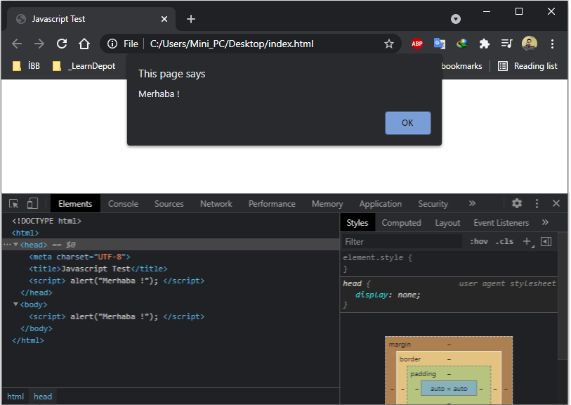

# 💎 JavaScript

## Javascirpt Tanımlama ve Dış Bağlantı

```markup
<!DOCTYPE html>
<html>
      <head> 
            <meta charset="UTF-8">
            <title>Javascript Test</title>
            <script> alert("Merhaba !"); </script>
      </head> 
      <body> 
            <script> alert("Merhaba !"); </script>
      </body>
</html>
```

🔵 Javascript genellikle _**&lt;head&gt;**_ veya _**&lt;body&gt;**_ tag'ları içerisinde çalıştırılır. Her ikisine de yazılmasına gerek yoktur. Sayfanın çalıştırılma prensibi ve yükleme hızı göz önüne alınarak tercihte bulunularak yazılır. Yukarıdaki örnekte basit bir Javascript yapısı bulunmaktadır. Javascript tanımlamaları sayfa içerisinde yapılacaksa mutlaka _**&lt;script&gt;**_ ile başlamalı ve _**&lt;/script&gt;**_ ile kapatılmalıdır. Script tag içerisinde bulunun _**alert\(\);**_ ise sayfa yüklendiğinde ekrana uyarı mesajı verilmesini sağlar. 



🔵 Eğer Javascript tagları içerisinde komplike ve birden fazla işlem yapılacaksa hem daha düzenli olması hem de ileride yapılabilecek değişikliklerde yada meydana gelecek hatalarda kod satırlarının anlaşılabilir olması için ayrı bir dosya haline getirilerek dış bağlantı şeklinde projeye eklenmesi daha sağlıklı olacaktır. Bunun için tıpkı bir _**.html**_ dosyası oluşturur gibi sonu _**.js**_ ile biten bir Javascript dosyası oluşturmamız ve _**&lt;script&gt;**_ tagları içerisindeki kod satırlarımızı buraya aktarmamız gereklidir. Daha sonrasında bu kodların index veya oluşturulan başka bir sayfada işlenebilir olması için bağlantısının _**"src"**_ ile yapılması gerekmektedir. Bu bağlantı aşağıda bulunan örnekteki gibi yapılmaktadır. 

```markup
<!DOCTYPE html>
<html>
      <head> 
            <meta charset="UTF-8">
            <title>Javascript Test</title>
            <script src="BlogScript.js"></script>
      </head> 
      <body>
            ...
      </body>
</html>
```

## Javascirpt Output \(Çıktı\) İşlemleri

🔵 Javascript işlemlerinden geri dönüş sağlamak, sayfa içerisindeki herhangi bir elemente değer atamak, sayfada bildirim gerçekleştirmek ve konsol çıktıları oluşturmak için kullanılan kod yapılarını 4 başlıkta topluyoruz. Bunlar;

* **alert\(\) veya window.alert\(\)**

  🔹 Aslında ikisi de aynı işlevi görmektedir. Amacı sayfa yüklendiğinde ekrana bildirim göndermektir.

```javascript
alert("Sayfaya Hoşgeldiniz !!!");
window.alert("Sayfaya Hoşgeldiniz !!!");
```

* **innerHTML** 🔹 Seçili olan element veya elementlerin istenilen değeri almasını sağlar.


innerHTML yapısının kullanılabilmesi için değer verilmesi istenilen element veya elementler mutlaka seçilmelidir. Seçim işlemlerinde elementin _**id, name, class**_ veya _**tag**_ türü kullanılabilir.




Değer verilmek istenilen elementin ID değerine göre atama yapan kod parçacığıdır. ID unique olması gerektiğinden tek bir ID değerine atama yapılır.

```javascript
document.getElementById("ID_Adi").innerHTML = "Atanacak_Deger";
```



Değer verilmek istenilen elementlerin ad değerine göre atama yapan kod parçacığıdır. Ad değeri birden fazla elementte aynı olarak kullanılabileceğinden çoğul işlemler gerçekleştirir. Aynı ad içerisindeki element kümesinde değer verilmek istenilen elementin indis değeri belirtilmelidir.

```javascript
document.getElementsByName("Name_Adi")[0].value = "Atanacak_Deger";
```


innerHTML eğer bir form işleminde veya input için kullanılacaksa value olarak yazılmalıdır. Çünkü bu alanlarda değer yazdırılma yapılmaz, değer atanması gerçekleştirilir.




Değer verilmek istenilen elementlerin class değerine göre atama yapan kod parçacığıdır. Class değeri birden fazla elementte aynı olarak kullanılabileceğinden çoğul işlemler gerçekleştirir. Aynı class içerisindeki element kümesinde değer verilmek istenilen elementin indis değeri belirtilmelidir.

```javascript
document.getElementsByClassName("Class_Adi")[0].innerHTML = "Atanacak_Deger";
```



Değer verilmek istenilen elementlerin tag türüne göre atama yapan kod parçacığıdır. Tag değeri birden fazla elementte aynı olarak kullanılabileceğinden çoğul işlemler gerçekleştirir. Aynı tag içerisindeki element kümesinde değer verilmek istenilen elementin indis değeri belirtilmelidir.

```javascript
document.getElementsByTagName("Tag_Turu")[0].innerHTML = "Atanacak_Deger";
```




Programlama dillerinde indis değerleri sıfırdan başlar.


* **document.write\(\)** 🔹Sayfanın boş olan herhangi bir yerinde istenilen yazının veya değerin görüntülenmesini sağlar.

```javascript
document.write("Sayfada Gözükecek Yazı...");
```

* **console.log\(\)** 🔹Tarayıcı kaynak görüntülemesinde bulunun konsol sekmesinde istenilen işlemlerin görüntülenmesini sağlar.

```javascript
console.log("Bu Bir Konsol Denemesidir !");
```


Javascript'te tıpkı diğer birçok dildeki gibi her bir kod satırı noktalı virgül ";" işareti ile ayrılır.

Açıklama satırı eklenecek ise çift eğik çizgi "//" veya yıldız-eğik çizgi "/\*......\*/" kullanılır.





## Javascript Variable \(Değişken\) Tanımlama

🔵 Javascript içerisinde değişken tanımlamak son derece kolaydır. Bazı dillerde olduğu gibi tanımlama yapılacak olan değişkenin türünün belirtilmesine ihtiyaç yoktur. Değişken tanımlarken ingilizce anlamı olan variable'ın kısaltılmışı _**"var"**_ kullanılır. Değişkene değer ataması yapmak için _**eşittir "="**_ operatörü kullanılır.  
  
         **`var`** `DegiskenAdi` = `AtanacakDeger;`


Her değişken için tanımlama yapılırken değer atamasına gerek yoktur. Yani bazı değişkenler kullanılacaklar zamanlarda değer alabilir.  
  
**`var`** `DegiskenAdi;`


🔵 Değişkenler; **Sayı** _**"int"**,_ **Ondalıklı Sayı** _**"double"**,_ **Metinsel** _**"string"** ve_ **Mantıksal "**_**boolean"**_ olarak tanımlanabilir.

```javascript
var sayi1 = 10;    //int
var sayi2 = 2.5;   //double
var metin = "Blog";    //string
var durum = false;    //boolean
```


Eğer bir değişkene yapılan atamanın hangi türde yapıldığı bilinmiyor veya hatırlanmıyorsa yada değişken türü değişimlerinde kontroller yapılacaksa, _**typeof\(degisken\)**_ kod parçacığı ile tür bilgisi öğrenilebilir.

document.write\(_**typeof\(deger1\)**_\);  
// Sayfa içerisindeki herhangi bir yere "deger1" adlı değişkenimizin türünü yazdırır.





## Javascript Operatörleri

🔵 Operatörler Matematiksel, Atama, Metinsel, Karşılaştırma, Mantıksal ve Koşul olmak üzere altı gruba ayrılırlar.

* **Matematiksel Operatörler** 🔹Toplama, Çıkarma, Bölme, Çarpma, Mod, Arttırma ve Azaltma işlemleri bu operatörler aracılığıyla yapılır.

```javascript
var Sonuc;

Sonuc = 6+4;    //Toplama Operatörü
Sonuc = 6-4;    //Çıkarma Operatörü
Sonuc = 3*2;    //ÇarpmaOperatörü
Sonuc = 8/4;    //Bölme Operatörü
Sonuc = 4%2;    //Mod Alma Operatörü

Sonuc = ++Sayi;    //Bu Operatör Sayi değişkenini önce 1 arttırır sonra Sonuc değişkenine atar 
Sonuc = Sayi++;    //Bu Operatör Sayi değişkenini önce Sonuc değişkenine atar sonra 1 artırır
Sonuc = --Sayi;    //Bu Operatör Sayi değişkenini önce 1 azaltır sonra Sonuc değişkenine atar
Sonuc = Sayi--;    //Bu Operatör Sayi değişkenini önce Sonuc değişkenine atar sonra 1 azaltır
```

* **Atama Operatörleri** 🔹Doğrudan Atayarak, Toplayarak Çıkararak, Bölerek, Çarparak ve Mod alarak değer atama işlemleri bu operatörler aracılığıyla yapılır.

```javascript
var Sayi;

Sayi = 0;    //Doğrudan Atama
Sayi += 5;    //Toplayarak Atama (Sayi = Sayi + 5) işleminin kısa gösterimidir
Sayi -= 5;    //Çıkararak Atama (Sayi = Sayi - 5) işleminin kısa gösterimidir
Sayi *= 5;    //Çarparak Atama (Sayi = Sayi * 5) işleminin kısa gösterimidir
Sayi /= 5;    //Bölerek Atama (Sayi = Sayi / 5) işleminin kısa gösterimidir
Sayi %= 5;    //Mod Alarak Atama (Sayi = Sayi % 5) işleminin kısa gösterimidir
```

* **Metinsel Operatör** 🔹Birden fazla metinsel değişkenin birleştirilmesinde kullanılır. Toplama işleminde olduğu gibi buradaki operatör _**artı "+"**_ birleştirme işlevi görür.

```javascript
var Metin1 = "Blog";
var Metin2 = "JavaScript";
var BirlesikMetin;

BirlesikMetin = Metin1 + Metin2;    //Metinleri Boşluksuz Birleştirir
// Çıktısı = BlogJavaScript

BirlesikMetin = Metin1 + " " + Metin2;    //Eğer birleştirme işleminde boşluk isteniyorsa
// Çıktısı = Blog JavaScript
```

* **Karşılaştırma Operatörleri** 🔹Değişkenler arasında Eşitlik, Denklik, Büyüklük ve Küçüklük gibi karşılaştırma işlemleri bu operatörler aracılığıyla yapılır.

```javascript
var Sayi1 = 3;
var Sayi2 = 7;
var Comp;    //Karşılaştırmalarda true/false değeri alacaktır

Comp = Sayi1 == Sayi2;    //Sayi1, Sayi2'ye Eşit Midir ? -> False
Comp = Sayi1 === Sayi2;    //Sayi1, Sayi2'ye Denk (Tür ve Değeri Aynı) Midir ? -> False
Comp = Sayi1 != Sayi2;    //Sayi1, Sayi2'ye Eşit Değil Midir ? -> True
Comp = Sayi1 > Sayi2;    //Sayi1, Sayi2'den Büyük Müdür ? -> False
Comp = Sayi1 < Sayi2;    //Sayi1, Sayi2'den Küçük Müdür ? -> True
Comp = Sayi1 >= Sayi2;    //Sayi1, Sayi2'ye Büyük Eşit Midir ? -> False
Comp = Sayi1 <= Sayi2;    //Sayi1, Sayi2'ye Küçük Eşit Midir ? -> False
```

* **Mantıksal Operatörler** 🔹Ve, Veya ile Değili karşılaştırmaları bu operatörler aracılığıyla yapılır.

```javascript
var Deger1 = true;
var Deger2 = false;
var Comp;    //Karşılaştırmalarda true/false değeri alacaktır

Comp = Deger1 && Deger2;    //Ve Operatörü. Her İki değerin aynı olmasında true değerini döndürür -> False
Comp = Deger1 || Deger2;    //Veya Operatörü. Değerlerden herhangi birisinin true olmasında true değerini döndürür -> True
Comp = !Deger1 ;    //Değili Operatörü. Değerin karşıtını döndürür -> False
```

* **Koşul Operatörü** 🔹Atanan değere göre True veya False değerinin tutulmasını sağlar.

```javascript
var Deger = true;
var Comp;

Comp = Deger ? "Deger true" : "Deger false";
//Deger değişkeni true ise Comp değişkeni Deger true, false ise Comp değişkeni Deger false değerini alır
```



## Javascript Function \(Fonksiyon\) Kullanımı

🔵 Javascript'te Function\(Fonksiyon\) tekrar eden veya sık kullanılan işlemlerin tek bir yerden kontrol edilmesini sağlar. Oluşturulan fonksiyon işlem yapılacak kod bloğu içerisinde çağrılarak değer gönderilir ve Function\(Fonksiyon\) içerisinden de yapılan işlemlerin sonucu geri döndürülür. Örnek vermek gerekirse, bir mağazada satılan bir ürünün ücret ödemesiyle ilgili hesaplama yapılacak olsun. Bu ürüne ödenen ücretten ürün ücreti çıkarılarak geri ödenecek ücretin hesaplanması gereksin. O halde;

```javascript
var UrunUcreti = 250;
var OdenenUcret = 325;
var GeriOdeme;
GeriOdeme = OdenenUcret - UrunUcreti;
```

🔹 Şeklinde tanımlamalar ve işlemleri gerçekleştirmemiz gerekecektir. Fakat bu üründen bir tane değil de yirmi adet sipariş edilmiş olursa ne olur ? Bizim bu yapmış olduğumuz kodlamayı yirmi defa yazmamız gerekir. Yirmi işlem için dört satır kod yazdığımızda aslında seksen satırlık kod oluşturmuş oluyoruz. Bu işlem yorumlayıcı için oldukça yüklü ve gereksiz bir süreç haline geliyor. Üstelik ürün fiyatından değişiklik olması durumunda bu seksen satırı tekrar gözden geçirmemiz gerekiyor olacak. Daha kötüsü değişken adında değişiklik olması durumunda işin içinden çıkılamayacak bir hal alması bile söz konusu olabilir. İşte tam da bu ve bunun gibi sebeplerden dolayı Function\(Fonksiyon\) kullanıyoruz. Function\(Fonksiyon\) kullanımını basit bir şekilde öncelikle şöyle örnekleyebiliriz;

```javascript
function Mesaj(){
    document.write("Bu Bir Fonksiyon Mesajıdır");
}

Mesaj();
```

🔹Burada yapmış olduğumu işlemle öncelikle _**"Mesaj"**_ adında bir Function\(Fonksiyon\) oluşturduk. İçerisinde _**"document.write\(\)"**_ komutu ile bir yazı ekledik. Ve beşinci satırımızda _**"Mesaj\(\)"**_ fonksiyonu çağırarak içerisindeki komutun ekrana yazılmasını sağladık. Fakat burada sabit bir komutun ekrana yazılmasını görüyoruz. Peki yukarıdaki örnekteki gibi geri ödenecek ücret hesaplamasını nasıl bu şekilde yapabiliriz. Bunun için Function\(Fonksiyon\)'umuza parametre tanımlaması ve bu parametreye fonksiyon çağrılırken değer göndermemiz gerekli. Bu işlemi ise şöyle yapıyoruz;

```javascript
function Hesaplama(OdenenUcret){
    var UrunUcreti = 250;
    var GeriOdeme;
    GeriOdeme = OdenenUcret - UrunUcreti;
    document.write(GeriOdeme);
}

var GonderilenUcret = 325;
Hesaplama(GonderilenUcret);

//Çıktısı : 75
```

🔹_**"Hesaplama"**_ adında bir fonksiyon oluşturduk ve bu fonksiyonumuzun içerisinde tekrar edecek işlemlerimizi sabitledik. _**"UrunUcreti"**_ ve _**"GeriOdeme"**_ değişkenlerimizi tanımladık ve geri ödenecek ücretin hesaplanması için gerekli matematiksel operatörü kullanarak işlemimizi gerçekleştirdik. Sonucumuzu sayfaya yazdırdık. Peki hesaplama yapılırken fonksiyonumuz _**"OdenenUcreti"**_ nasıl aldı ? Bunun cevabı dokuzuncu satırımızda. Biz bu satırda fonksiyonumuzun _**parantez "\(\)"**_ ****işaretleri içerisinde tanımlı _**"OdenenUcret"**_ parametresine sekizinci satırda tanımlamış olduğumuz _**"GonderilenUcret"**_ değişkenimizin değerini gönderdik. Fonksiyonumuzda parametresine gelen değeri yapmasını istediğimiz işlem satırında kullanarak sonucu bizim ekranımıza yazdırdı.


Function\(Fonksiyon\)'a gönderilecek değer _**parantez "\(\)"**_ içerisinde parametre olarak gönderilir. Parantez içerisinde birden fazla parametre gönderilebilir. Gönderilecek parametreler birden fazla ise _**virgül ","**_  işareti ile ayrılır.


```javascript
function Hesaplama(OdenenUcret, Siparisci){
    var UrunUcreti = 250;
    var GeriOdeme;
    GeriOdeme = OdenenUcret - UrunUcreti;
    document.write(Siparisci + " Kişisine " + GeriOdeme + " TL Ödeme Yapılacak !");
}

var GonderilenUcret = 325;
var AdSoyad = "Elif USLU";
Hesaplama(GonderilenUcret, AdSoyad);

//Çıktısı : Elif USLU Kişisine 75 TL Ödeme Yapılacak !
```

🔹Yukarıdaki örnekte hem ücret hem de ücreti ödeyen kişinin ad soyad bilgisini içeren değişkenlerin değerlerini iki ayrı parametre ile fonksiyonumuza gönderdik. Fonksiyonumuz parametrelerine gelen değerleri ilgili işlem satırında kullanarak ekrana sonucu yazdırdı. Peki fonksiyonumuzun içerisindeki değeri her zaman ekrana yazdırmak istemezsek veya sonuç değişkenimizi başka bir işlemde veya fonksiyonda kullanmak istersek ne yapmamız gerekiyor ? Bu seferde fonksiyon çağırma işleminin aslında tersini yapmamız yani değer döndürmemiz gerekiyor. Fonksiyon içerisinde değer döndürmek için ise _**"return"**_ kullanılır.

```javascript
function Hesaplama(OdenenUcret, Siparisci){
    var UrunUcreti = 250;
    var GeriOdeme;
    GeriOdeme = OdenenUcret - UrunUcreti;
    return(Siparisci + " Kişisine " + GeriOdeme + " TL Ödeme Yapılacak !");
}

var GonderilenUcret = 325;
var AdSoyad = "Elif USLU";
document.write(Hesaplama(GonderilenUcret, AdSoyad)); 

//Çıktısı : Elif USLU Kişisine 75 TL Ödeme Yapılacak !
```

🔹_**"return"**_ ekleyerek sonuç değerimizi onuncu satırda fonksiyonumuzu çağırmak için kullandığımız satıra geri döndürdük ve ekranımıza yazdırdık. Sonuç değerimizi ekrana yazdırmak istemiyorsak _**"document.write\(\)"**_ yerine bir değişken tanımlaması yaparak sonuç değerimizi atayabiliriz.

```javascript
 var SonucDeger = Hesaplama(GonderilenUcret, AdSoyad); 
```



## Javascript Object \(Objeler\) Kullanımı

🔵 Javascript'te bir nesne veya kişilik ile ilgili tanımlamalar yapılacaksa Object\(Objeler\) kullanılır. Çünkü Object\(Objeler\) kullanımı diziye benze _**Array**_ türünde olduğundan içerisinde birden fazla özellik tanımlaması yapılabilir. Yapılan bu tanımlamalar obje içerisinde veya dışında fonksiyonlar oluşturularak çağrılabilir ve kullanılabilir. Object\(Objeler\) içerisinde özellik tanımlamaları yapılırken _**süslü parantez "{}"**_ açılır, her bir tanımlamadan sonra _**virgül ","**_ konulur. Basit yapıda Object\(Objeler\) kullanımına bakacak olursak;

```javascript
var Araba = {
    Markasi : "Honda",
    Modeli : "Civic",
    Motoru : "1.6",
    Yili : 2000,
    Rengi : "Gri"    
}

console.log(Araba);
```


🔹Eğer _**"Araba"**_ objesinde tanımlamış olduğumuz özelliklerden seçim yapmazsak yukarıdaki console çıktısında olduğu gibi eklemiş olduğumuz tüm özellikleri bir _**Array**_ olarak listelenmiş şekilde görürüz. Mesela biz sadece arabanın _**"Markası"**_ bilgisini console yazdırmak istiyorsak bu sefer;

```javascript
console.log(Araba.Markasi);    //Araba objemizinin sadece Markasi özelliğini yazıdırır
```

🔹Object\(Objeler\) içerisinde fonksiyon tanımlayarak bazı işlemler gerçekleştirebiliriz. Peki fonksiyon tanımlamasını Object\(Objeler\) içerisinde nasıl gerçekleştiriyoruz ?

```javascript
var Araba = {
    Markasi : "Honda",
    Modeli : "Civic",
    Motoru : "1.6",
    Yili : 2000,
    Rengi : "Gri",
    Calistir : function(){
        alert("Motor Çalıştırıldı !");
    }    
}

console.log(Araba.Markasi);
Araba.Calistir();
```

🔹_**"Calistir"**_ adından bir fonksiyon oluşturduk ve bu fonksiyonumuzu objemizin dışından çağırdık. O zaman objemizin içerisinde oluşturduğumuz başka bir fonksiyonla yine obje içerisinde bir işlem yapabilir miyiz ?

```javascript
var Araba = {
    Markasi : "Honda",
    Modeli : "Civic",
    Motoru : "1.6",
    Yili : 2000,
    Rengi : "Gri",
    Calistir : function(){
        alert("Motor Çalıştırıldı !");
    },    
    Bilgiler: function(){
        console.log("Markası : " + Araba.Markasi);
        console.log("Modeli: " + Araba.Modeli);
        console.log("Motoru: " + this.Motoru );
        console.log("Yili: " + this.Yili );
        console.log("Rengi: " + this.Rengi );
    }  
}

console.log(Araba.Markasi);
Araba.Calistir();
Araba.Bilgiler();
```


🔹Bilgiler adında başka bir fonksiyon oluşturduk ve bu fonksiyonumuz içerisinde _**"Araba"**_ objesine ait özellikleri console ekranına yazdırdık. Bazı özellikleri yazdırırken _**"this"**_ kullandık. _**"Araba.Markasi"**_ ile _**"this.Markasi"**_ kullanımı arasındaki temel fark _**"this"**_ kullandığınızda bu objeyi doğrudan ifade ettiğinizden sadece bu obje içerisinde bulunan bir özelliği çekebilmenizdir. Yani _**"Araba.Markasi"**_ kullanımında _**"Araba"**_ yerine başka bir obje yazabilir, dışarıdan bir objenin özelliklerini çekebilirsiniz. Ama _**"this"**_ kullanıyorsanız yalnızca _**Araba"**_ objesinin _**süslü parantez "{}"**_ içerisindeki özelliklerinden bilgi çekebilirsiniz.

```javascript
var Araba = {
    Markasi : "Honda",
    Modeli : "Civic",
    Motoru : "1.6",
    Yili : 2000,
    Rengi : "Gri",
    Bilgiler: function(){
        console.log("Markası : " + this.Markasi);
        console.log("Kullanan: " + Kullanici.Adi);
    }  
}
var Kullanici = {
    Adi : "Berk"
}

Araba.Bilgiler();
```


​​ 🔹Obje içerisindeki fonksiyon işlemleri ile daha önce yapmış olduğumuz fonksiyon işlemleri arasında hiçbir fark yoktur. Orada yapmış olduğumuz tüm işlemleri burada da gerçekleştirebiliriz.

```javascript
var Araba = {
    Markasi : "Honda",
    Modeli : "Civic",
    Yili : 2000,
    Bilgiler: function(){
        console.log("Markası : " + this.Markasi);
        console.log("Modeli: " + this.Modeli);
        console.log("Kullanan: " + Kullanici.Adi);
    },
    YasHesapla : function(){
        return (2021 - this.Yili);
    }
}
var Kullanici = {
    Adi : "Berk"
}

Araba.Bilgiler();
console.log(Araba.YasHesapla());
```


🔹Daha önce fonksiyon işlemlerinde yaptığımız gibi matematiksel operatör kullanarak _**"Araba"**_ objemiz içerisinde _**"Yili"**_ özelliğindeki değeri arabamızın yaşını hesaplamak için kullandık. Çıkan sonucu _**"return"**_ ederek console ekranına yazdırdık.



## Javascript Event \(Olaylar\) Kullanımı


